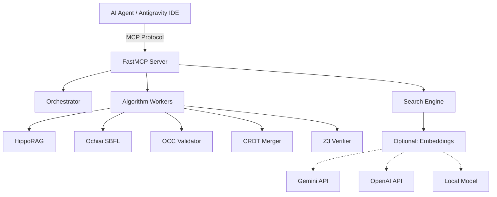

# 🐝 Project Swarm v1.0

**A Python-native, algorithmically augmented orchestrator for autonomous AI software engineering.**

[](https://python.org)
[](https://docker.com)
[](https://modelcontextprotocol.io)
[](LICENSE)

---

## 🎯 Overview

Project Swarm is an **MCP-native orchestrator** that augments AI agents with specialized algorithms for code analysis, search, debugging, and collaborative editing. Built for **Antigravity IDE** and compatible with any MCP client.

### Key Features

- **🔍 Hybrid Search Engine** - Semantic + keyword search with optional embeddings
- **🧠 HippoRAG Retrieval** - AST-based knowledge graphs with Personalized PageRank
- **🐛 Ochiai SBFL** - Automated fault localization for debugging
- **🔒 OCC Validator** - Optimistic Concurrency Control for conflict-free edits
- **🌐 CRDT Merger** - Real-time collaborative editing support
- **✅ Z3 Verifier** - Symbolic execution and formal verification
- **⚖️ Consensus Engine** - Weighted voting for multi-agent decision making
- **🐳 Docker Ready** - Runs as an MCP server locally or in containers

---

## ⚡ Quick Start

### Option 1: Docker (Recommended)

```bash
# Clone the repository
git clone https://github.com/yourusername/swarm.git
cd swarm

# Start the MCP server
docker compose up -d --build

# Verify it's running
docker compose logs -f swarm-orchestrator
# Server available at http://localhost:8000
```

### Option 2: Local Installation

```bash
# Clone and install dependencies
git clone https://github.com/yourusername/swarm.git
cd swarm
pip install -r requirements.txt

# Run the orchestrator CLI
python orchestrator.py status

# Or run as MCP server
python -m fastmcp run server.py
```

---

## 🔌 Antigravity IDE Integration

Project Swarm is built to integrate with **Antigravity IDE** via the Model Context Protocol (MCP).

### Configuration

Add to your Antigravity agent configuration:

```json
{
  "mcpServers": {
    "swarm-orchestrator": {
      "command": "docker",
      "args": ["exec", "-i", "swarm-mcp-server", "fastmcp", "run", "server.py"],
      "enabled": true,
      "autoAllow": ["search_codebase", "get_status", "retrieve_context"]
    }
  }
}
```

For local (non-Docker) setup:

```json
{
  "mcpServers": {
    "swarm-local": {
      "command": "python",
      "args": ["-m", "fastmcp", "run", "server.py"],
      "cwd": "/path/to/swarm",
      "env": {
        "PYTHONUNBUFFERED": "1"
      }
    }
  }
}
```

See [`examples/mcp-configs/`](./examples/mcp-configs/) for more configuration examples (Cursor, CLI tools, etc.).

---

## 🛠️ MCP Tools Available

Once connected, your AI agent has access to these tools:

| Tool | Description | Use Case |
|:-----|:------------|:---------|
| `process_task(instruction)` | Execute a task using Swarm's algorithmic workers | Code refactoring, analysis, complex workflows |
| `search_codebase(query)` | Hybrid semantic + keyword search | Quick code discovery, feature location |
| `index_codebase(path)` | Build search index with embeddings | First-time setup, after major changes |
| `retrieve_context(query)` | HippoRAG deep context retrieval | Architectural analysis, understanding relationships |
| `get_status()` | Check blackboard state | Monitor task progress |

### CLI Commands

Swarm also provides a rich CLI for direct usage:

```bash
# Search and indexing
python orchestrator.py index           # Build search index
python orchestrator.py search "auth"   # Quick keyword search
python orchestrator.py find "MyClass"  # Exact term lookup

# Advanced algorithms
python orchestrator.py retrieve "database layer"  # HippoRAG context
python orchestrator.py debug --test-cmd pytest    # Ochiai fault localization
python orchestrator.py verify "function_name"     # Z3 symbolic verification

# Project management
python orchestrator.py status          # Check orchestrator state
python orchestrator.py validate        # Run quality gates
python orchestrator.py benchmark       # Performance metrics
```

---

## ⚙️ Optional Features

Swarm is designed to work with minimal dependencies, but offers enhanced capabilities when optional features are enabled.

### 🔍 Semantic Search (Embeddings)

**Default:** Keyword-only search (no external dependencies)

**Optional:** Enable semantic search with API-based or local embeddings.

#### Option A: Gemini Embeddings (Recommended)

```bash
# Set API key
export GEMINI_API_KEY="your-key-here"

# Index with Gemini embeddings
python orchestrator.py index --provider gemini
```

**Provider:** Google Gemini API  
**Model:** `models/embedding-001`  
**Setup:** `pip install google-generativeai` (already in requirements.txt)

#### Option B: OpenAI Embeddings

```bash
# Set API key
export OPENAI_API_KEY="your-key-here"

# Index with OpenAI embeddings
python orchestrator.py index --provider openai
```

**Provider:** OpenAI API  
**Model:** `text-embedding-3-small`  
**Setup:** `pip install openai` (already in requirements.txt)

#### Option C: Local Embeddings (Offline)

For air-gapped or offline environments:

```bash
# 1. Uncomment in requirements.txt:
# sentence-transformers>=2.2.0

# 2. Install
pip install sentence-transformers

# 3. Index with local model
python orchestrator.py index --provider local
```

**Provider:** sentence-transformers  
**Model:** `all-MiniLM-L6-v2` (384-dim, fast)  
**Setup:** ~400MB download on first run

#### Configuration Details

The search engine automatically detects available providers:

```python
# In search_engine.py
def get_embedding_provider(provider_type="auto"):
    """
    Auto-detection order:
    1. GEMINI_API_KEY → GeminiEmbedding
    2. OPENAI_API_KEY → OpenAIEmbedding
    3. sentence-transformers → LocalEmbedding
    4. None → Keyword-only search
    """
```

**When to use each:**
- **Gemini**: Best quality, fast, requires internet + API key
- **OpenAI**: Alternative to Gemini, similar quality
- **Local**: Offline capability, no API costs, slower indexing
- **None (keyword)**: Works immediately, exact/partial matching only

### 🧮 Z3 Symbolic Verification

**Optional:** Install Z3 for formal verification capabilities.

```bash
# Already in requirements.txt
pip install z3-solver>=4.12.0
```

**Size:** ~100MB  
**Use case:** Proving code correctness mathematically

### 📊 Code Coverage (SBFL)

**Optional:** Install coverage tools for Ochiai fault localization.

```bash
# Already in requirements.txt
pip install coverage>=7.0
```

**Use case:** Automated debugging with spectrum-based fault localization

---

## 🏗️ Architecture



### Task-Based Dispatch

The orchestrator routes tasks to specialized algorithms based on flags:

```python
if task.context_needed:
    → HippoRAG (AST graph + PageRank)
if task.tests_failing:
    → Ochiai SBFL (fault localization)
if task.conflicts_detected:
    → OCC Validator (concurrency control)
if task.concurrent_edits:
    → CRDT Merger (collaborative editing)
if task.verification_required:
    → Z3 Verifier (symbolic execution)
```

---

## 🔧 Configuration

### Environment Variables

```bash
# Optional: Embedding providers (choose one)
export GEMINI_API_KEY="your-gemini-key"
export OPENAI_API_KEY="your-openai-key"
export GOOGLE_API_KEY="your-google-key"  # Alias for Gemini

# Docker-specific (if using docker compose)
# Add to .env file in project root
PYTHONUNBUFFERED=1
GEMINI_API_KEY=your-key
```

### Docker Compose

The `docker-compose.yml` automatically passes environment variables:

```yaml
services:
  swarm-orchestrator:
    environment:
      - GEMINI_API_KEY=${GEMINI_API_KEY:-}
      - OPENAI_API_KEY=${OPENAI_API_KEY:-}
    ports:
      - "8000:8000"
```

---

## 📦 Dependencies

### Core (Required)

```
pydantic>=2.9.0        # Data validation
typer>=0.12.0          # CLI framework
rich>=13.9.0           # Terminal output
filelock>=3.15.0       # State management
fastmcp>=2.0.0         # MCP server
```

### Optional (Enable Features)

```
# Semantic Search (pick one or none)
google-generativeai>=0.3.0    # Gemini embeddings
openai>=1.0.0                 # OpenAI embeddings
# sentence-transformers>=2.2.0  # Local embeddings (offline)

# Algorithm Workers
networkx>=3.0          # HippoRAG graphs (required)
pycrdt>=0.9.0          # CRDT (required)
z3-solver>=4.12.0      # Symbolic verification (optional)
coverage>=7.0          # SBFL debugging (optional)
```

See [`requirements.txt`](./requirements.txt) for full list.

---

## 🧪 Testing & Quality

```bash
# Run test suite
python -m pytest tests/ -v

# Run quality gates
python orchestrator.py validate

# Check coverage
pytest --cov=mcp_core tests/
```

**Quality Targets:**
- ✅ 95% Unit Test Coverage
- ✅ 85% Mutation Score
- ✅ Zero Lint Errors (flake8)

---

## 🤝 Contributing

See [`CONTRIBUTING.md`](./CONTRIBUTING.md) for guidelines.

---

## 📄 License

MIT License - See [`LICENSE`](./LICENSE) for details.

---

## 🔗 Resources

- **MCP Protocol:** https://modelcontextprotocol.io
- **Antigravity IDE:** (Configure with examples in `examples/mcp-configs/`)
- **FastMCP:** https://github.com/jlowin/fastmcp
- **Docker:** https://docs.docker.com/get-docker/

---

**Built with 💜 for autonomous AI development**
